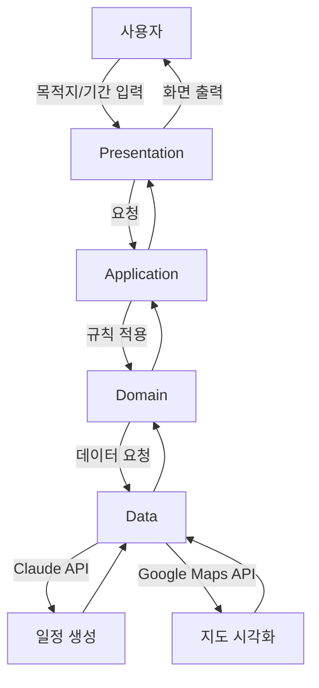

# TR 앱 아키텍처

## 개요
AI 기반 여행 플래너 앱. 목적지와 기간을 입력하면 Claude API가 최적의 여행 일정을 생성하고 Google Maps로 시각화한다.

## 레이어 구조

| 레이어 | 폴더 | 역할 |
|---|---|---|
| Presentation | `lib/presentation/` | 화면, 위젯, 테마 |
| Application | `lib/application/` | 상태관리, 비즈니스 흐름 |
| Domain | `lib/domain/` | 핵심 규칙, 엔티티 |
| Data | `lib/data/` | API 호출, 로컬 저장 |

## 시스템 다이어그램

## 디렉토리 구조
lib/
├── main.dart
├── app.dart
├── presentation/
│   ├── screens/
│   ├── widgets/
│   └── theme/
├── application/
│   └── view_models/
├── domain/
│   ├── entities/
│   └── services/
└── data/
├── repositories/
├── api/
└── local/

## 핵심 기능별 레이어 흐름

| 기능 | Presentation | Application | Domain | Data |
|---|---|---|---|---|
| 일정 입력 | InputScreen | TripViewModel | Trip | - |
| AI 일정 생성 | ResultScreen | PlanViewModel | PlanService | ClaudeApi |
| 지도 시각화 | MapScreen | MapViewModel | Location | MapsApi |
| 일정 저장 | HistoryScreen | HistoryViewModel | Trip | LocalDb |